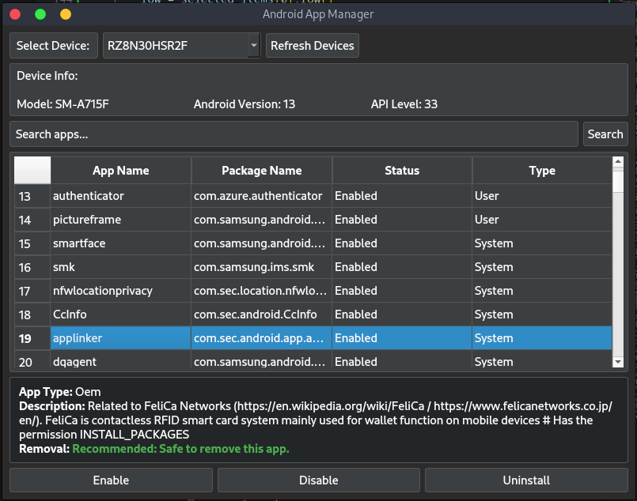

# Android App Manager



Android App Manager is a Python-based GUI application that allows users to manage their Android applications via ADB (Android Debug Bridge). It provides functionality to list, search , disable, enable and uninstall applications.

## Features

- List all installed applications on your Android device.
- Application info
- Debloating your phone
- Disable any application.
- Enable any application.
- Uninstall any application.
- Search for applications.


## Requirements

- Python 3.x
- PyQt5
- ADB installed and set in PATH

## Usage

1. Connect your Android device to your computer.
2. Enable USB debugging on your Android device.
3. Run the script.

```bash
pip install -r requirements.txt
python main.py
```

The application will start and display a GUI to manage your Android applications.

## Note

This tool uses ADB commands to manage applications. Please ensure you understand the implications of disabling/enabling applications on your Android device. Always use this tool responsibly.

## Contributing

Pull requests are welcome. For major changes, please open an issue first to discuss what you would like to change.

## License

[MIT](https://choosealicense.com/licenses/mit/)

## Disclaimer

This tool is for educational purposes only. The developer is not responsible for any misuse of this tool.
